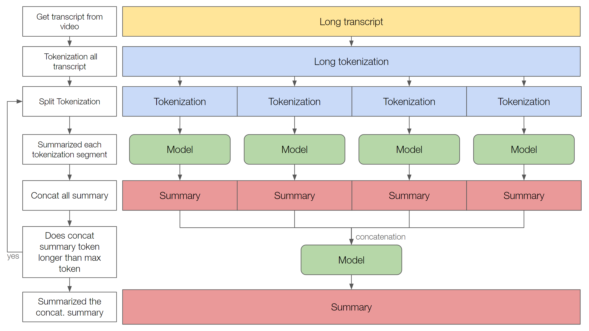

# Youtube Summariser
This project is a gradio based web application that takes a youtube video link as input and returns a summary of the video. The summary is generated using the bart_large_cnn model.

## Embedding/Tokenization
The transcript of the video are fetch from the [youtube_transcript_api](https://github.com/jdepoix/youtube-transcript-api), the transcript is recursively split, embedded in encoder-decoder model ([bart_large_cnn](https://huggingface.co/facebook/bart-base)) to generate the summary and concatenated until the the length of the length is less than 1024. Then final summary is then returned to the user.




## Installation
```sh
git clone https://github.com/Tomtunn/Youtube_Digest.git
cd Youtube_Digest
pip install -r requirements.txt
```

## to run the demo
```sh
garadio app.py
```
